# Assignment #2 Report

---

**Course**: ECE 572; Summer 2025  
**Instructor**: Dr. Ardeshir Shojaeinasab  
**Student Name**: Liam Tarry  
**Student ID**: V00939002  
**Assignment**: Assignment 2  
**Date**: July 12th, 2025  
**GitHub Repository**: [(https://github.com/ltarry/ECE572_Summer2025_SecureText)]

---

## Executive Summary

<!-- 
Provide a brief overview of what you accomplished in this assignment. 
For Assignment 1: Focus on vulnerabilities found and security improvements made
For Assignment 2: Focus on authentication enhancements and Zero Trust implementation  
For Assignment 3: Focus on cryptographic protocols and end-to-end security
Keep this section to 1-2 paragraphs.
-->

In this assignment, I implemented a series of zero-trust and authentication implementations to our securetext application. This included multi-factor authentication with time based one-time passwords in task four, OAuth (Open Authentication) via github in task 5 and zero trust implementation through challenge-response authentication, role based access, and basic monitoring. All implementations within each task were done to introduce various tactics and methodologies used in following the zero trust principle, i.e. trusting no user in your network and verifying everything (commands, system changes etc.).

---

## Table of Contents

1. [Introduction](#introduction)
2. [Task Implementation](#task-implementation)
   - [Task 4](#task-4)
   - [Task 5](#task-5)
   - [Task 6](#task-6)
3. [Security Analysis](#security-analysis)
4. [Attack Demonstrations](#attack-demonstrations)
5. [Lessons Learned](#lessons-learned)
6. [Conclusion](#conclusion)
7. [References](#references)

---

## 1. Introduction

### 1.1 Objective
<!-- Describe the main objectives of this assignment -->
The main objective of this assignment is to further implement more complex security methods to our vulnerable messaging app to better protect it from the various vulnerabilities identified in assignment #1. With the new implementations and protocols, I will also demonstrate and explain their use cases and how they better protect our application overall. The concepts covered include: modern authentication patterns, multi-factor authentication, and zero-trust principles.

### 1.2 Scope
<!-- Define what you implemented and what you focused on -->
The implementations added included: multi-factor authentication with time-based one-time passwords, zero authentication protocols and challenge-response authentications protocols and zero-trust principles. I focused on following the README procedures and ensuring I understood exactly what was being asked to ensure I was implementing it correctly.

### 1.3 Environment Setup
<!-- Briefly describe your development environment -->
- **Operating System**: Kali Linux
- **Python Version**: 3.13.2
- **Key Libraries Used**: pyotp, cryptography, fernet, qrcode[pil], collections, webbrowser, urllib.parse(urlparse, parse_qs), requests, logging
- **Development Tools**: VSCode, Github Co-Pilot, ChatGPT

---

## 2. Task Implementation

<!-- Replace Task X, Y, Z with actual task numbers and names  -->

### 2.1 Task 4: Multi-Factor Authentication with TOTP

#### 2.1.2 Implementation Details
<!-- Describe your implementation approach and include the corresponding screenshots -->

The below code snippets set up the structure for a TOTP in our client side terminal. The key libraries used include pyotp, cryptography, fernet, and qrcode in order to allow new users to set up and generate TOTP on each login. The QRcode allows for easy set up in an authenticator app such as Microsoft authenticator. The following screenshot shows our hardcoded fernetkey generation that was used for the TOTP. The code snippets below respectively comment each addition made to our current methods to implement the TOTP.

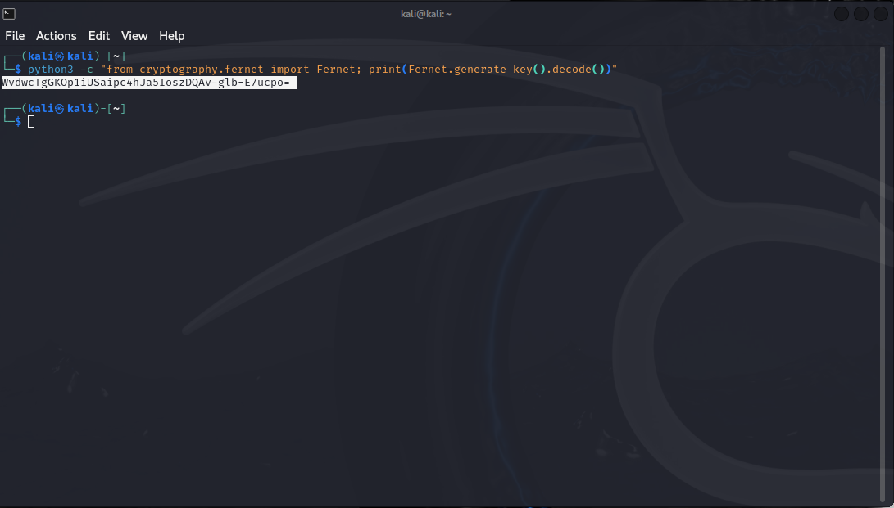


**Key Components**:
- Component 1: [TOTP Implementation: Base TOTP, QR Code Generation, Enhanced Authentication Flow]
- Component 2: [Security Analysis and Attack Demonstration: Demonstrate Authentication Bypass, TOTP Security Analysis, Attack Vectors and Mitigations]
- Component 3: [User Experience Considerations: Security vs. Usability]

**Code Snippet** (Key Implementation):
```python
#The below is all for Task 4 Part A:

    #Updated create_account, authenticate, and login methods
        def create_account(self, username, password):
        """Create new user account with SHA-256 hashed password"""
        if username in self.users:
            return False, "Username already exists", None, None
    
        # Hash password with SHA-256
        password_hash = self.hash_password_sha256(password)
    
        #Generate a unique TOTP secret for the user here
        totp_secret = pyotp.random_base32()
        encrypted_secret = self.encrypt_totp_secret(totp_secret)
        self.users[username] = {
            'password_hash': password_hash,
            'totp_secret': encrypted_secret, # Store TOTP encrypted secret
            'created_at': datetime.now().isoformat(),
            'reset_question': 'What is your favorite color?',
            'reset_answer': 'blue'
        }
        self.save_users()
        # Generate TOTP URI and display QR code
        uri = self.generate_totp_uri(username, totp_secret)
        return True, "Account created successfully", totp_secret, uri

    #Cleaned up and our authenticate method to incorporate TOTP
    def authenticate(self, username, password, totp_code=None):
        """Authenticate user with support for all formats, migration, and TOTP"""
        if username not in self.users:
            return False, "Username not found"
        user = self.users[username]

        # Check Password for all formats:
        password_ok = False    
    
        #Plaintext password storage
        if 'password' in user:
            if user['password'] == password:
                password_ok = True
                self.migrate_user_password(username, password)
    
        #Old unsalted SHA-256 hash
        elif 'password_hash' in user and isinstance(user['password_hash'], str):
            test_hash = hashlib.sha256(password.encode()).hexdigest()
            if test_hash == user['password_hash']:
                password_ok = True
                self.migrate_user_password(username, password)
    
        #New format hashes
        elif 'password_hash' in user and isinstance(user['password_hash'], dict):
            stored_hash = user['password_hash']
            if stored_hash['hash_type'] == 'sha256_salted':
                salt = base64.b64decode(stored_hash['salt'])
                verification_hash = self.hash_password_sha256(password, salt)
                if verification_hash['hash'] == stored_hash['hash']:
                    password_ok = True
                    self.migrate_user_password(username, password)
            elif stored_hash['hash_type'] == 'pbkdf2':
                if self.verify_password_pbkdf2(password, stored_hash):
                    password_ok = True

        if not password_ok:
            return False, "Invalid password"

        # Check TOTP
        if 'totp_secret' in user:
            if not totp_code:
                return False, "TOTP code required"
            totp_secret = self.decrypt_totp_secret(user['totp_secret'])
            totp = pyotp.TOTP(totp_secret)
            if not totp.verify(totp_code):
                return False, "Invalid TOTP code"

    def login(self):
        """Login to the system"""
        print("\n=== Login ===")
        username = input("Enter username: ").strip()
        password = input("Enter password: ").strip()
        totp_code = input("Enter TOTP code (from your authenticator app): ").strip()

        command = {
            'command': 'LOGIN',
            'username': username,
            'password': password,
            'totp_code': totp_code
        }

        response = self.send_command(command)
        print(f"{response['message']}")

    #Added to the handle_client method
        if command == 'CREATE_ACCOUNT':
            username = message.get('username')
            password = message.get('password')
            success, msg = self.create_account(username, password)
            response = {'status': 'success' if success else 'error', 'message': msg}
                if success:
                    response['totp_secret'] = message.get('totp_secret')
                    response['totp_uri'] = message.get('totp_uri')
        elif command == 'LOGIN':
            username = message.get('username')
            password = message.get('password')
            totp_code = message.get('totp_code')
            success, msg = self.authenticate(username, password, totp_code)
                if success:
                    current_user = username
                    self.active_connections[username] = conn
                    response = {'status': 'success' if success else 'error', 'message': msg}
                        
                elif command == 'SEND_MESSAGE':
                    if not current_user:
                        response = {'status': 'error', 'message': 'Not logged in'}
                    else:
                        recipient = message.get('recipient')
                        msg_content = message.get('content')

    #Fernet Key hardcoded in for the application (bad in practice, will be used to demo in this)
    FERNET_KEY = b'WvdwcTgGKOp1iUSaipc4hJa5IoszDQAv-glb-E7ucpo='

    #Added to the init method:
    self.fernet = Fernet(self.FERNET_KEY)

    #Helper methods for our Fernet Key and QR Code URI in our SecureTextServer Class:
    def encrypt_totp_secret(self, secret):
        """Encrypt TOTP secret using Fernet"""
        return self.fernet.encrypt(secret.encode()).decode()

    def decrypt_totp_secret(self, encrypted_secret):
        """Decrypt TOTP secret using Fernet"""
        return self.fernet.decrypt(encrypted_secret.encode()).decode()
    
    def generate_totp_uri(self, username, secret):
        """Generate a TOTP URI for QR code setup"""
        return f"otpauth://totp/SecureText:{username}?secret={secret}&issuer=SecureText"

    def display_qr_ascii(self, uri):
        """Display QR code as ASCII art in the console"""
        qr = qrcode.QRCode(
            version=1,
            error_correction=qrcode.constants.ERROR_CORRECT_Q,  # High error correction
            box_size=2,
            border=2,
        )
        qr.add_data(uri)
        qr.make(fit=True)
        qr.print_ascii(invert=True)

    #Generating TOTP URI for user added in the SecureTextServer class:
    def generate_totp_uri(self, username, secret):
        """Generate a TOTP URI for QR code setup"""
        return f"otpauth://totp/SecureText:{username}?secret={secret}&issuer=SecureText"

    #Added to create_account method on client side:
        response = self.send_command(command)
        print(f"{response['message']}")
        if response.get('totp_secret'):
            print(f"\n[2FA] Add this secret to your authenticator app: {response['totp_secret']}")
            print(f"Or scan this URI with your authenticator app: {response['totp_uri']}")
            # Optionally, display QR code in client (requires qrcode lib on client side)
            try:
                import qrcode
                qr = qrcode.QRCode()
                qr.add_data(response['totp_uri'])
                qr.make(fit=True)
                qr.print_ascii(invert=True)
            except Exception:
                print("(Install 'qrcode' Python package to see QR code in terminal.)")

#Code for Part C:
    #In the __init__ method:
    self.totp_attempts = collections.defaultdict(lambda: {'count': 0, 'last_attempt': 0})

    #In the authenticate method:
        return False, "Invalid username or password" #Does not let user know if username or password is incorrect

    #...

            if not password_ok:
            return False, "Invalid username or password" #Do not let user know if username or password is incorrect
        
        # Rate limiting for TOTP
        import time
        now = time.time()
        attempts = self.totp_attempts[username]
        # Reset counter if last attempt was more than 60 seconds ago
        if now - attempts['last_attempt'] > 60:
            attempts['count'] = 0
        attempts['last_attempt'] = now
        if attempts['count'] >= 5:
            return False, "Too many TOTP attempts. Please wait and try again."

        # TOTP check with tolerance
        if 'totp_secret' in user:
            if not totp_code:
                return False, "TOTP code required"
            totp_secret = self.decrypt_totp_secret(user['totp_secret'])
            totp = pyotp.TOTP(totp_secret)
            # Accept codes within ±1 time step (default 30s)
            if not (totp.verify(totp_code, valid_window=1)):
                attempts['count'] += 1
                return False, "Invalid TOTP code"
            # Reset counter on success
            attempts['count'] = 0
        
        return True, "Authentication successful"


```
#### 2.1.3 Challenges and Solutions
<!-- What problems did you encounter and how did you solve them? -->
Problems I encountered with task 4 was initially understanding what tolerance windows were. My initial understanding of tolerance windows were the 30 second period of time a user has to enter their TOTP on a registered authenticator app when that is not the case. What it took for me to find a solution or begin to actually understand what they were was to read real-world examples and compare, which will be promptly noted in my security analysis below.

#### 2.1.4 Security Analysis and Attack Demonstration
<!-- Attack Demo and Explanations -->
**Demonstrating Authentication ByPass**
A scenario where passwords are compromised but TOTP protects the account would be any standard password leak. Take for example my "liam4" account displayed in the screenshot in the following section as well. If the password for liam4 had been leaked prior, any user could login with the password to the account and gain complete access. However, now that TOTP is configured for newly created accounts, malicious users may have the password to a users account but without the second factor, will not gain full access as shown in the following screenshot:

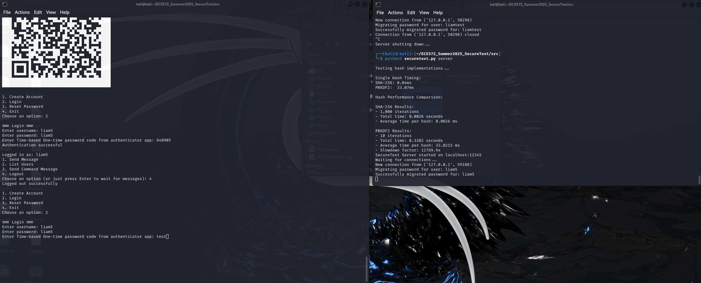

The next screenshot shows a blocked access with an invalid TOTP:

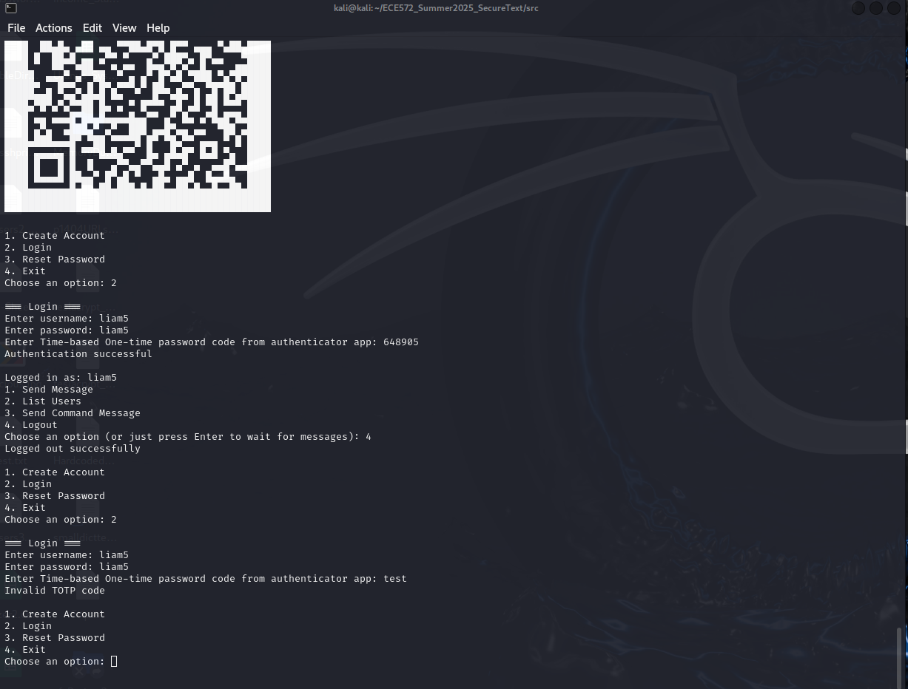

***TOTP Security Analysis***

In the library of pyotp, the cryptographic foundation for my application's TOTP is using HMAC-SHA1 with time windows for a user to verify their identity with the prompted TOTP. The time windows used in the Microsoft authenticator app are 30 seconds, giving users a 30 second frame per each TOTP to login with. While SHA-1 has been proven to be vulnerable given enough computational power (i.e. through collision) (<https://www.entrust.com/blog/2014/10/understanding-sha-1-vulnerabilities-is-ssl-no-longer-secure#:~:text=What%20are%20the%20issues%20with,2018%20and%20$43%2C000%20in%202021.>). In our context and time windowes HMAC-SHA1 is still considered secure given the requirement for an attacker to know our shared secret key (<https://supertokens.com/blog/otp-vs-totp-vs-hotp>). 

Issues can arise with synchronization conflicts and tolerance windows. For synchronization issues, the server and a client must have synchronized clocks to allow for the TOTP to function correctly. If the user or server have an inaccurate or desynchronized clock, the TOTP will not work and deny access to the user (<https://supertokens.com/blog/otp-vs-totp-vs-hotp>). Tolerance windows correlate with our synchronization between devices. A tolerance window is the allotted amount of time given extra in the authentication process where the server will accept passwords generated slightly past allotted times to account for delays or mis-synced devices, typically measured in time steps (<https://frontegg.com/blog/what-is-a-time-based-one-time-password-totp#:~:text=A%20minor%20time%20skew%20might,reliability%20and%20usability%20of%20TOTP.>). The length of your window is dependent on the level of security you want and convenience for your user, i.e. the longer the window the more suspectible it is to an attack but easier for a user to login. A longer tolerance window also can allow for errors in clock syncs between our two devices (<https://www.loginradius.com/blog/engineering/advantages-of-totp>). It is important to note that the tolerance window is different from that of the 30 seconds lifespan a password will have on you authenticator app. 

For recovery scenarios, backup code implementation is typically done by allowing users to generate recovery codes with one-time use and store them on their own accord in the event their 2FA app or device is disabled or no longer works. The server will store a hashed list of these generated codes with the user's data on their backend database. Typically, these codes are recognized server side through an associated userID. When a user submits a recover code a flag for the recovery session is added allowing the user to swap authentication methods or devices (<https://supertokens.com/docs/additional-verification/mfa/backup-codes#:~:text=You%20can%20achieve%20this%20by,Password%20(TOTP)%20device%20page.>). It is advised to keep these recovery codes in secure seperate storage spaces to access in the event of a necessary recovery. In my application, it would be best to recommend users safely secure and store a list of generated recovery codes for them in the event they lose access to their 2FA.
(ACTUALLY ADD IN CODE??)


***Attack Vectors and Mitigations***

SIM Swapping attacks, which are also referred to as SIM porting or SIM hijacking, are attacks where an attacker transfers your mobile phone number to their SIM card without your knowledge, tricking your provider (<https://www.ownyouronline.govt.nz/personal/know-the-risks/common-risks-and-threats/sim-swapping-attacks/#:~:text=A%20SIM%20swap%20attack%20is,access%20to%20your%20personal%20information.>). This is done by an attacker getting any publicly available information on you that they can, calling your phone provider and impersonating you, and ask to have your mobile number swapped SIMs. This allows for them to bypass SMS 2FA mechanisms to your online accounts via your phone number (<https://en.wikipedia.org/wiki/SIM_swap_scam>). 

This introduces pros and cons between TOTP apps and SMS 2FA security for protecting users accounts. While TOTP can be less convenient for the user due to issues in clock syncs or application reliance requring extra steps in account recover, it is still considered more secure than SMS based 2FA due to the ability for an attacker to conduct SIM swapping attacks (<https://stytch.com/blog/totp-vs-sms/>). SMS 2FA will use one time based passwords on each login attempt that is often significantly more convenient with autofill from text messages being a feature in common mobile OS allowing a user to remain in the application, it does in turn lead to more vulnerabilities. TOTP apps on the other hand are more difficult from a user perspective but more secure in their use case due to phishing capabilities and extent (<https://stytch.com/blog/totp-vs-sms/>).

SMS 2FA is weaker top phishing attacks by its own nature outside of SIM swapping attacks. Phone number are much more common knowledge and so attackers can craft manufactured SMS 2FA texts and phishing bait to prompt users to input sensitive information or credentials much easier as it is a more publicly available means of communication. This is much harder to do with TOTP applications as the user will rely exclusively on the trusted application on their physcial device. The physical device aspect of TOTP also deters SIM swapping as even if users swap phone numbers to a different SIM, they need the physical device in the instance of TOTP. For other 2FA methods as well such as email, the same phishing problems exist, phishing emails and scams are much more commonplace due to the public nature of individuals email addresses and are therefore much more susceptible to phishing type attacks.

(TEST CODE AND ADD MORE NON LEAKING ERROR MESSAGES)

#### 2.1.5 Testing and Validation
<!-- How did you test that your implementation works correctly? -->

Before conducting our security analysis, our base TOTP code implementation was tested and displayed working on a fresh account creation in the following screenshot:

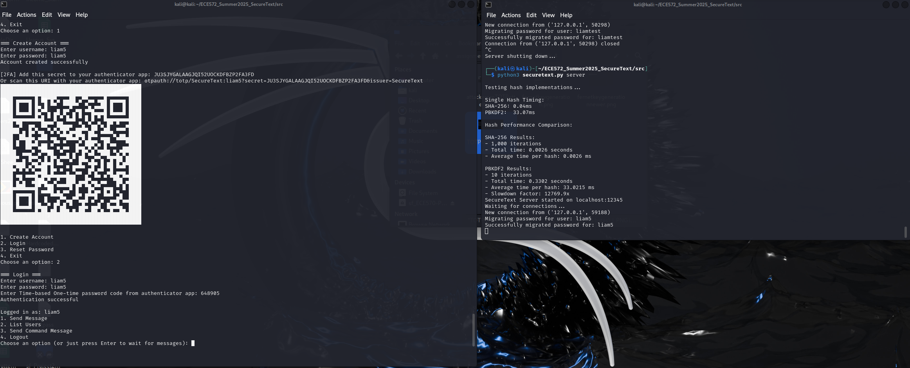


---

### 2.2 Task 5: [OAUth Integration]

#### 2.2.1 Objective
<!-- What was the goal of this task? -->
The goal of this task was to introduce a OAuth (Open Authentication) authorization method into our securetext app through a console based system in a simple version. This was done using GitHub's OAuth developer setting provision to allow users of the application to create an account and login through their GitHub account via a firefox browser popup. The implementation of this was to demonstrate how many modern applications let users login through trusted identity providers using account from different website or applications, reducing the number of passwords needed to be known and used by a user.


#### 2.2.2 Implementation Details
<!-- Describe your implementation approach -->
The implementration approach taken was to folow the instructions used in the assignment readme file, research the overall design and common approaches to using OAuth (AuthO came up very frequently in my research), understanding how the OAuth authentication flow works as I implemented the code, leveraged GenAI tools for context specific questions and problems I had, along with reading example code online for reference work (<https://docs.github.com/en/apps/oauth-apps/building-oauth-apps/authorizing-oauth-apps>).

**Key Components**:
- Component 1: [Console-Compatible OAuth 2.0 Implementation: Choose an OAuth Provider, Console OAuth Login, User Info Extraction, and Hybrid Authentication]
- Component 2: [Security Features: Secure OAuth Flow, Session Handling]
- Component 3: [Security Analysis: Benefits of OAuth Authentication, Known OAuth Vulnerabilities]

**Code Snippet** (Key Implementation):

```python


#Part A Code Implementation for Console-Compatible OAuth 2.0 Implementation
client_id = "Ov23liKAGQ5DVCq4cMlJ"
redirect_uri = "http://localhost"
state = secrets.token_urlsafe(16)
scope = "read:user"

params = {
    "client_id": client_id,
    "redirect_uri": redirect_uri,
    "scope": scope,
    "state": state,
    "allow_signup": "true"
}
auth_url = "https://github.com/login/oauth/authorize?" + urllib.parse.urlencode(params)

print("Opening browser for GitHub login...")
webbrowser.open(auth_url)
print("If the browser does not open, please visit this URL manually:")
print(auth_url)

redirect_response = input("After logging in, paste the full redirect URL here: ").strip()

client_secret = "821ba2e2fba93c6b3825a7045580d141f6e8942a"
token_url = "https://github.com/login/oauth/access_token"
headers = {"Accept": "application/json"}
data = {
    "client_id": client_id,
    "client_secret": client_secret,
    "code": code,
    "redirect_uri": redirect_uri,
    "state": state
}

response = requests.post(token_url, headers=headers, data=data)
token_json = response.json()
access_token = token_json.get("access_token")
print("Access token:", access_token)

headers = {
    "Authorization": f"token {access_token}",
    "Accept": "application/json"
}

    # Get user info
user_resp = requests.get("https://api.github.com/user", headers=headers)
user_info = user_resp.json()
github_username = user_info.get("login")
print(f"Authenticated GitHub username: {github_username}")

    # Get user email (may be private, so use /emails endpoint)
email_resp = requests.get("https://api.github.com/user/emails", headers=headers)
emails = email_resp.json()
primary_email = None
for email_entry in emails:
    if email_entry.get("primary"):
        primary_email = email_entry.get("email")
        break
print(f"Primary GitHub email: {primary_email}")

    #OAuth through Github for our SecureTextClient class:
def github_login(self):
        """Login using GitHub OAuth"""
        #Hardcoded GitHub OAuth Credentials for our demo environment.
        self.logout()  # Ensure any previous session is cleared
        client_id = "Ov23liKAGQ5DVCq4cMlJ"
        client_secret = "821ba2e2fba93c6b3825a7045580d141f6e8942a"
        redirect_uri = "http://localhost"
        state = secrets.token_urlsafe(16)
        scope = "read:user user:email"

        # PKCE: Generate code_verifier and code_challenge
        code_verifier = secrets.token_urlsafe(64)
        code_challenge = base64.urlsafe_b64encode(
            hashlib.sha256(code_verifier.encode()).digest()
        ).decode().rstrip("=")

        params = {
            "client_id": client_id,
            "redirect_uri": redirect_uri,
            "scope": scope,
            "state": state,
            "allow_signup": "true",
            "code_challenge": code_challenge,
            "code_challenge_method": "S256"
        }
        auth_url = "https://github.com/login/oauth/authorize?" + urllib.parse.urlencode(params)
        print("Opening browser for GitHub login...")
        webbrowser.open(auth_url)
        print("If the browser does not open, please visit this URL manually:")
        print(auth_url)
        redirect_response = input("After logging in, paste the full redirect URL here: ").strip()
        from urllib.parse import urlparse, parse_qs
        parsed_url = urlparse(redirect_response)
        query_params = parse_qs(parsed_url.query)
        code = query_params.get("code", [None])[0]
        returned_state = query_params.get("state", [None])[0]
        if returned_state != state:
            print("State mismatch! Aborting for security.")
            return
        token_url = "https://github.com/login/oauth/access_token"
        headers = {"Accept": "application/json"}
        data = {
            "client_id": client_id,
            "client_secret": client_secret,
            "code": code,
            "redirect_uri": redirect_uri,
            "state": state,
            "code_verifier": code_verifier  #PKCE Addition for security
        }
        response = requests.post(token_url, headers=headers, data=data)
        token_json = response.json()
        if "error" in token_json:
            print("OAuth error:", token_json.get("error_description", token_json["error"]))
            return
        access_token = token_json.get("access_token")
        if not access_token:
            print("Failed to get access token.")
            return
        self.access_token = access_token
        headers = {
            "Authorization": f"token {access_token}",
            "Accept": "application/json"
        }
        user_resp = requests.get("https://api.github.com/user", headers=headers)
        user_info = user_resp.json()
        github_username = user_info.get("login")
        email_resp = requests.get("https://api.github.com/user/emails", headers=headers)
        emails = email_resp.json()
        
        primary_email = None
        if isinstance(emails, list):
            for email_entry in emails:
                if isinstance(email_entry, dict) and email_entry.get("primary"):
                    primary_email = email_entry.get("email")
                break
        else:
            print("Could not retrieve email list from GitHub:", emails)
            
        print(f"Authenticated GitHub username: {github_username}")
        print(f"Primary GitHub email: {primary_email}")
        # Send to server for hybrid authentication
        command = {
            'command': 'GITHUB_LOGIN',
            'github_username': github_username,
            'github_email': primary_email
        }
        response = self.send_command(command)
        print(f"{response['message']}")
        if response['status'] == 'success':
            self.logged_in = True
            self.oauth_logged_in = True
            self.username = github_username
            self.running = True
            listen_thread = threading.Thread(target=self.listen_for_messages)
            listen_thread.daemon = True
            listen_thread.start()

    #Added to our client run method:
            if not self.logged_in:
                print("\n1. Create Account")
                print("2. Login")
                print("3. Login with GitHub")  #New option for GitHub login
                print("4. Reset Password")
                print("5. Exit")
                choice = input("Choose an option: ").strip()
                
                if choice == '1':
                    self.create_account()
                elif choice == '2':
                    self.login()
                elif choice == '3':
                    self.github_login()
                elif choice == '4':
                    self.reset_password()
                elif choice == '4':
                    break
                else:
                    print("Invalid choice!")

    #Added to our handleclient method server-side:
elif command == 'GITHUB_LOGIN':
                        github_username = message.get('github_username')
                        github_email = message.get('github_email')
                        # Try to find a local user by email
                        matched_user = None
                        for uname, udata in self.users.items():
                            if udata.get('email') == github_email:
                                matched_user = uname
                                break
                        if matched_user:
                            # Link GitHub account to existing user
                            self.users[matched_user]['github_username'] = github_username
                            self.save_users()
                            current_user = matched_user
                            response = {'status': 'success', 'message': f"Logged in as {matched_user} (linked to GitHub {github_username})"}
                        else:
                            # Create new user with GitHub info and handle any conflicts here
                            new_username = github_username
                            suggestion_count = 1
                            while new_username in self.users:
                                new_username = f"{github_username}_{suggestion_count}"
                                suggestion_count += 1
                            if new_username != github_username:
                                response = {
                                'status': 'warning',
                                'message': f"Username '{github_username}' is taken. You have been assigned '{new_username}'."
                                }       
                            else:
                                response = {
                                    'status': 'success',
                                    'message': f"New account created and logged in as {new_username} (GitHub)"
                            }
                            self.users[new_username] = {
                            'github_username': github_username,
                            'email': github_email,
                            'created_at': datetime.now().isoformat(),
                            'auth_type': 'github'
                            }
                            self.save_users()
                            current_user = new_username
                            response = {'status': 'success', 'message': f"New account created and logged in as {new_username} (GitHub)"}

    #Added to our create_account method to handle any conflicts on local account creation with that of a GithubUser:
if username in self.users:
            #Suggesting new user to handle local account creation conflicts with Git Users
            suggestion_count = 1
            new_username = f"{username}_{suggestion_count}"
            while new_username in self.users:
                suggestion_count += 1
                new_username = f"{username}_{suggestion_count}"
            return False, f"Username already exists. Suggested: {new_username}", None, None8


#Part B Code Implementation for Security Features:
    #Random state to prevent CSRF is done in our github_login method here:
    state = secrets.token_urlsafe(16)

    #PKCE implemented via the following:
        #Generate code_verifier and code_challenge
        code_verifier = secrets.token_urlsafe(64)
        code_challenge = base64.urlsafe_b64encode(
            hashlib.sha256(code_verifier.encode()).digest()
        ).decode().rstrip("=")

        params = {
            "client_id": client_id,
            "redirect_uri": redirect_uri,
            "scope": scope,
            "state": state,
            "allow_signup": "true",
            "code_challenge": code_challenge,
            "code_challenge_method": "S256"
        }
        auth_url = "https://github.com/login/oauth/authorize?" + urllib.parse.urlencode(params)
        print("Opening browser for GitHub login...")
        webbrowser.open(auth_url)
        print("If the browser does not open, please visit this URL manually:")
        print(auth_url)
        redirect_response = input("After logging in, paste the full redirect URL here: ").strip()
        from urllib.parse import urlparse, parse_qs
        parsed_url = urlparse(redirect_response)
        query_params = parse_qs(parsed_url.query)
        code = query_params.get("code", [None])[0]
        returned_state = query_params.get("state", [None])[0]
        if returned_state != state:
            print("State mismatch! Aborting for security.")
            return
        token_url = "https://github.com/login/oauth/access_token"
        headers = {"Accept": "application/json"}
        data = {
            "client_id": client_id,
            "client_secret": client_secret,
            "code": code,
            "redirect_uri": redirect_uri,
            "state": state,
            "code_verifier": code_verifier  #PKCE Addition for security
        }
        response = requests.post(token_url, headers=headers, data=data)
        token_json = response.json()

    #Tokens are not stored and local vs. OAuth are distinguished as shown by following flags:
    #In our __init__ for our SecureTextClient Class, added these flags to keep access token in memory and clearly seperate OAuth users vs. local logins:
    self.oauth_logged_in = False
    self.access_token = None

    #In our github_login method for our SecureTextClient Class, added the following to continue our above goals:
    self.access_token = access_token
    self.oauth_logged_in = True

    #After a succesful login, session is stored via following flags in memory:
    #Initial token store for memory:
    self.access_token = access_token

    #If success:
    self.logged_in = True
    self.oauth_logged_in = True
    self.username = github_username

    #Added a dedicated logout method to keep token session specific and treat-session short-lived via logout:
    def logout(self):
        self.logged_in = False
        self.running = False
        self.username = None
        self.oauth_logged_in = False   # Reset OAuth login state
        self.access_token = None       # Reset access token
        print("Logged out successfully")

    #Added the following error message for expired or missing tokens to github_login method:
    if "error" in token_json:
            print("OAuth error:", token_json.get("error_description", token_json["error"]))
            return


```
#### 2.2.3 Challenges and Solutions
<!-- What problems did you encounter and how did you solve them? -->
The biggest problem I ran into when implementing this was implementing PKCE and keep sessions only in memory and not persistently for security purposes. These two proved challenging as I struggled to get the code verifier to work at first alongside with understanding the necessary flags and method calls needed to keep all vital information for a users authenticated session to be cleared on logout. However, that being said I am glad I did knowing the security disparity between not using PKCE and the dangers of storing tokens written persistantly as further explored in the security analysis below.

#### 2.2.4 Security Analysis and Attack Demonstration

**1. Benefits of OAuth Authentication:**
OAuth reduces the risks associated with passwords (such as reuse and leakage) by allowing users to login through other platforms and their credentials. Instead of requiring users to create their own account username and password, often leading to re-used or poor passwords by users across multiple webhsites or platforms, it allows auser to login via a trusted account with a third-party identity provider. This way, if a password is compromised on one site (such as in a password leakage) then the users credentials across multiple site are not compromised. If the users password from the third-party identity providoer does happen to be compromised in the event of a database leak, many OAuth providers will notify users of the leak such as with Auth0 (<https://www.weareplanet.com/blog/what-is-auth0>). In our Github OAuth implementation as well, a 2FA was required to login to m,y application through my Github account, providing an easy and secure methodlogy for users to sign into various different applications through this identify proofing means. Reducing the number of passwords required to be created and remembered by users also encourages users to use stronger passwords if it can be implemented across various platforms of their use, reducing the likelihood of brute-force attempts as well (<https://www.techtarget.com/searchapparchitecture/definition/OAuth#:~:text=OAuth%2C%20which%20is%20pronounced%20%22oh,credentials%20to%20the%20third%20party.>). 

The trade-offs that come with using the third-party identifier like our Github OAuth, include creating a central security weakness for user data, dependance on the vendors service and security, along with the increased complexity for implementation (<https://www.omnidefend.com/pros-and-cons-of-using-auth0-for-two-factor-authentication/>). For a central security weakness, if a OAuth provider is compromised in a password leak, this could cause significant impact on any application that use and rely on their OAuth for login security, essentially compromising the entirety of this application for example if OAuth was the primary means of login. As for dependence on vendor service and security, if the vendors OAuth is disconnected or having problems, this puts a strain on your own application or may even prevent users from accessing or using it at all. The same can be said for their security, your application now relies on their security of 2FA for login credentials into your own application. this can lead to vendor-lock in problems (relying entirely on the thrid party's infrastructure) and problems with adaptability and change. This also leads into our final trade-off with increased complexity. For smaller applications such as this one OAuth likely isn't necessary for the complexity required to implement and attempt to scale with the apps development. The complexity and reliance on OAuth can provide difficulty for major changes or updates in the development cycle for an organization's developers, putting time strains and extra work onto them. 


**2. Known OAuth Vulnerabilities:**
As for known OAuth vulnerabilities and their attack vectors, they include:

1. Authorization code interception: This is when a malicious actor intercepts the authorization code in the 2FA grant flow to obtain an access token without the client's knowledge (<https://www.authgear.com/post/pkce-in-oauth-2-0-how-to-protect-your-api-from-attacks#:~:text=Authorization%20Code%20Interception%3A%20In%20the,token%20without%20the%20client's%20knowledge.>)
2. Missing or Invalid State Parameters: This attack vector is when the state value returned does not match the one initially sent by the application or otherwise "gets lost" in the authentication flow (<https://community.auth0.com/t/invalid-state-error-when-using-authorize-endpoint-directly-in-conjunction-with-the-auth0-spa-sdk/105239>). This can be a sign of cross-site request forgery attempts by a malicious actor looking to hijack a valid user's session. If a state parameter is missing entirely, this leaves your application open to a CSRF attack through an attacker being able to hijack a session as their is no return check to the valid user's session login based on the state that would be exchanged in the authentication flow.
3. Redirect URI Manipulation: This attack occurs when a malicious actor edits or controls the callback URI in the authentication flow of OAuth. In our application this is the localhost redirect implemented. If an attacker edits or appends their own malicious URI and tricks a user into following that callback, they can steal a valid user's token to hijack a session, compromising the users account and gaining full control (<https://portswigger.net/web-security/oauth#:~:text=If%20the%20OAuth%20service%20fails,to%20an%20attacker%2Dcontrolled%20redirect_uri%20.>).
4. Token Leakage: This attack occurs when an access token for API calls at the end of the authentication flow, is stolen or compromised by a malicious actor. This can occur if the token is leaked in any way and can be exposed to an external party such as if a token was stored in a users browser (<https://portswigger.net/web-security/oauth#:~:text=If%20the%20OAuth%20service%20fails,to%20an%20attacker%2Dcontrolled%20redirect_uri%20.>). If tokens are stored in browser URLs and the user either clicks onto a third party-site or is redirected to a compromised redirect URI, an attacker can steal the token and bypass authentication logging in as the victim user (<https://portswigger.net/web-security/oauth#:~:text=If%20the%20OAuth%20service%20fails,to%20an%20attacker%2Dcontrolled%20redirect_uri%20.>).

In my simplified console-based application implementations I mitgate 3/4 of the attack vectors in my code:

For authorizsation code interception, this is mitigated through my implementation of PKCE. By introducing the challenge and verification on the client side, it ensures that only the intended client/ user is able to exchange for a token based on the code_verfiier known only on the client-side (<https://www.authgear.com/post/pkce-in-oauth-2-0-how-to-protect-your-api-from-attacks#:~:text=Authorization%20Code%20Interception%3A%20In%20the,token%20without%20the%20client's%20knowledge.>).

For missing or invalid state parameter exploits, this is mitigated by properly validating the generated state in my code, making sure the OAuth response is only for the session that had initialized the request shown in the snippet here:

```python
state = secrets.token_urlsafe(16)
# ... in params ...
"state": state
# ... after redirect ...
returned_state = query_params.get("state", [None])[0]
if returned_state != state:
    print("State mismatch! Aborting for security.")
    return
```

For redirect URI manipulation, this is the only attack vector that is still potentially compromisable to a malicious actor in my application. While I currently only have http://localhost as my authorization callback URL along with a fixed URI in my code, meaning that any appended or edited URI redirects should be denied. If there is a setting on GitHub's end I am unaware of that allows for multiple URIs then my application is vulnerable (<https://portswigger.net/web-security/oauth#:~:text=If%20the%20OAuth%20service%20fails,to%20an%20attacker%2Dcontrolled%20redirect_uri%20.>).

Lastly, for token leakage, this is mitigated in my code by ensuring tokens are only stored in memory and cleared on logout. This session specific token usage where it is neither logged or written to disk, makes it incredibly difficult for attackers to gain access to a token via leak and hijack a session. This is shown in my following code snippets:
```python
self.access_token = access_token

def logout(self):
    self.logged_in = False
    self.running = False
    self.username = None
    self.oauth_logged_in = False
    self.access_token = None
```

#### 2.2.6 Provider Configuration

When starting server, select option 3 to prompt a firefox browser pop-up, a URL is given if pop-up does not occur. Login with github account credentials and paste redirect URI to console. Once shown in assignment test, best practice is to logout from github to clear cache and nano users.json to remove username/ email from file. 

#### 2.2.6 Testing and Validation
<!-- How did you test that your implementation works correctly? -->
The implementation of my code was tested iteratively as displayed below.

For Part A: The following screenshots show a succesful test and validation for the launch of the URL in a pop-up browser along with the redirect URI, and a succesful login creating a new user via GitHub's OAuth.

1. Browser pop-up:

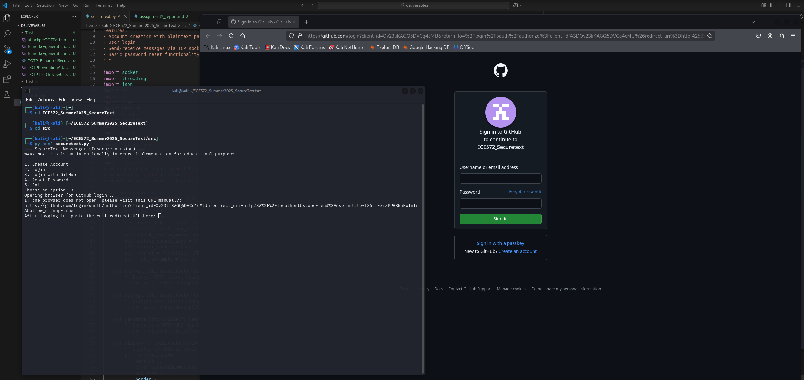

2. Redirect URI Set to LocalHost:

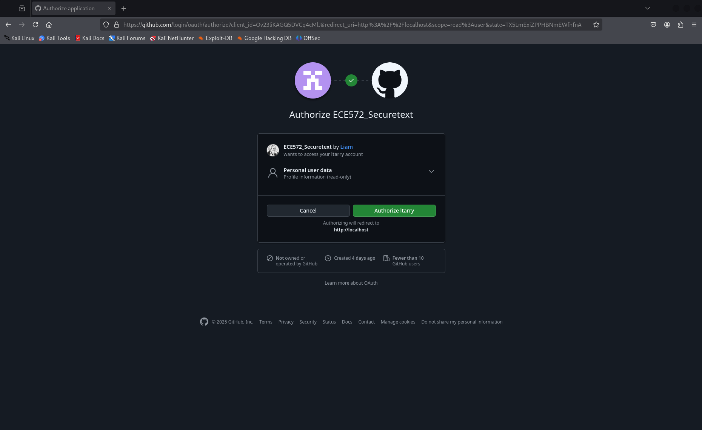

3. Succesful Parse and Login with New User, displaying their user in console:

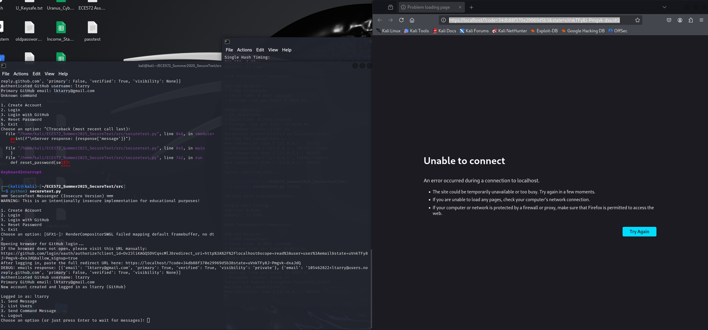

4. In these next three screenshots, we see not only a succesful login for both a local user and Github OAuth, but that our implementation also properly handles username conflicts and creates a new account if the same username exists already and warns users making accounts locally of username conflicts and what they could use instead. The screenshots are shown in that order respectively:

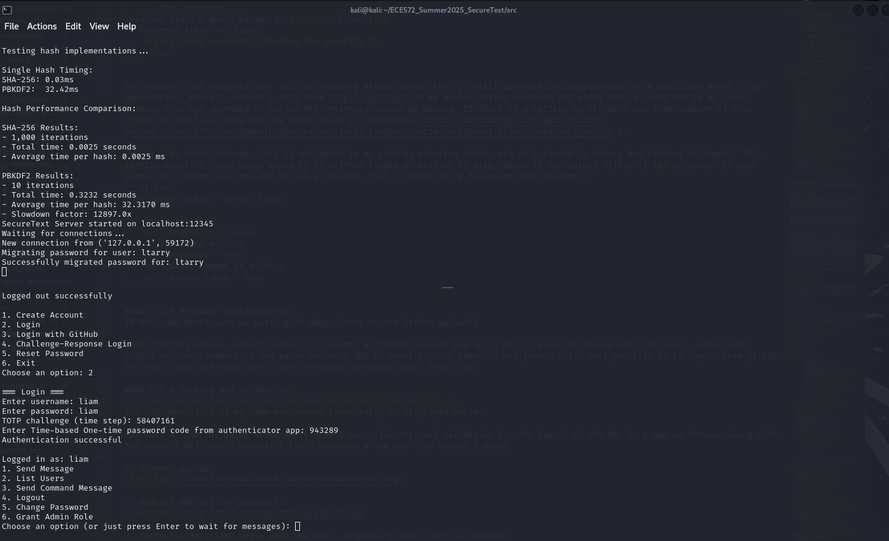

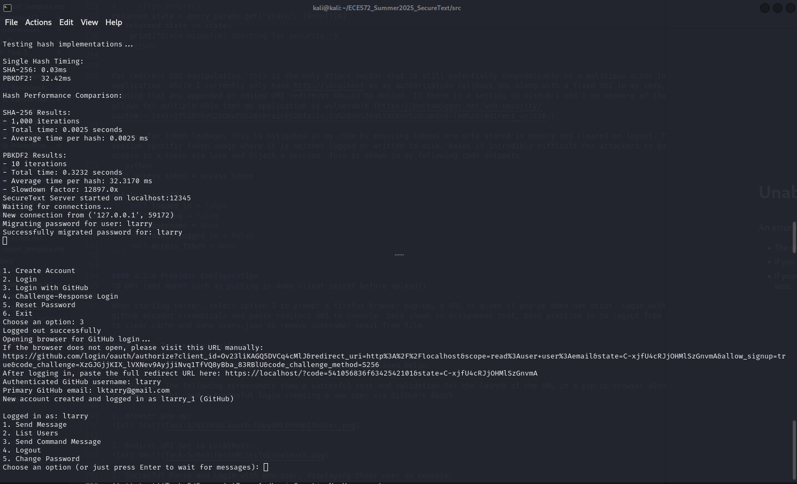

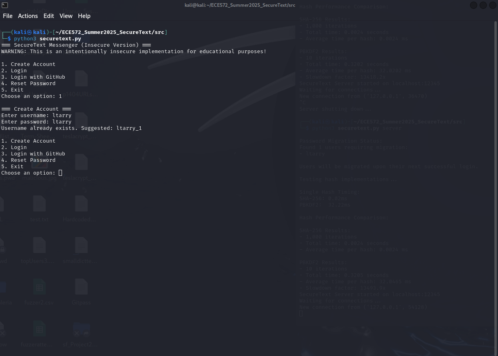


For Part B: The following screenshots show a succesful implementation of PKCE that prevents CSRF, proof the session and tokens are not written and instead stored in memory, cropped version of our GitHub succesful login showing in console a clear distinction for GitHub users vs. local, and handling expired or missing tokens via errors shown.

1. In this screenshot, we see a succesful login with PKCE proven by the code that is verified displayed in our URL of the redirect:

.png)

2. In this screenshot we see proof of tokens being stored in memory and not written through a quick cat into our users.json file:

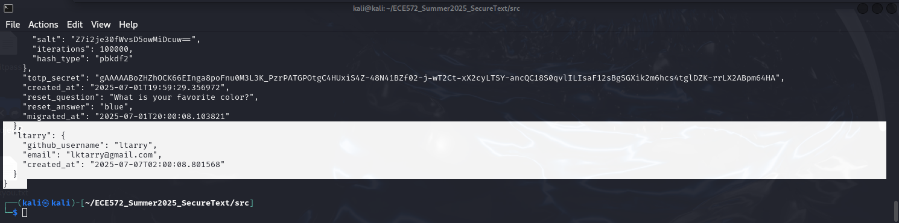

3. In the next two screenshots, we see how the console clearly differentiates GitHub users from local users, but also that it is differentiated in users.json while additionally we gracefully logout with no session information written to our users.json file in the first. For the second one, I went back and temporarily printed flags on logout to prove the session was NOT stored in memory:

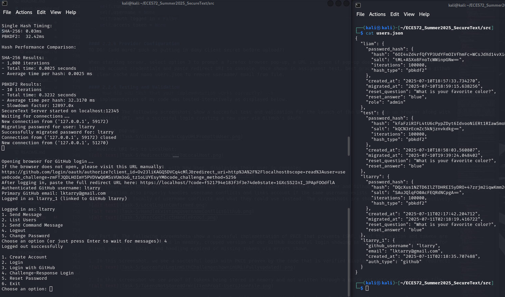

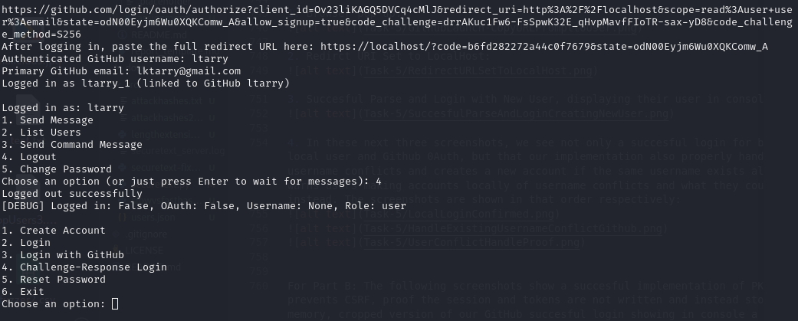

4. For the final testing and validation screenshots, shown here are succesful handling of any tampered, expired, or missing token in the authentication progress:

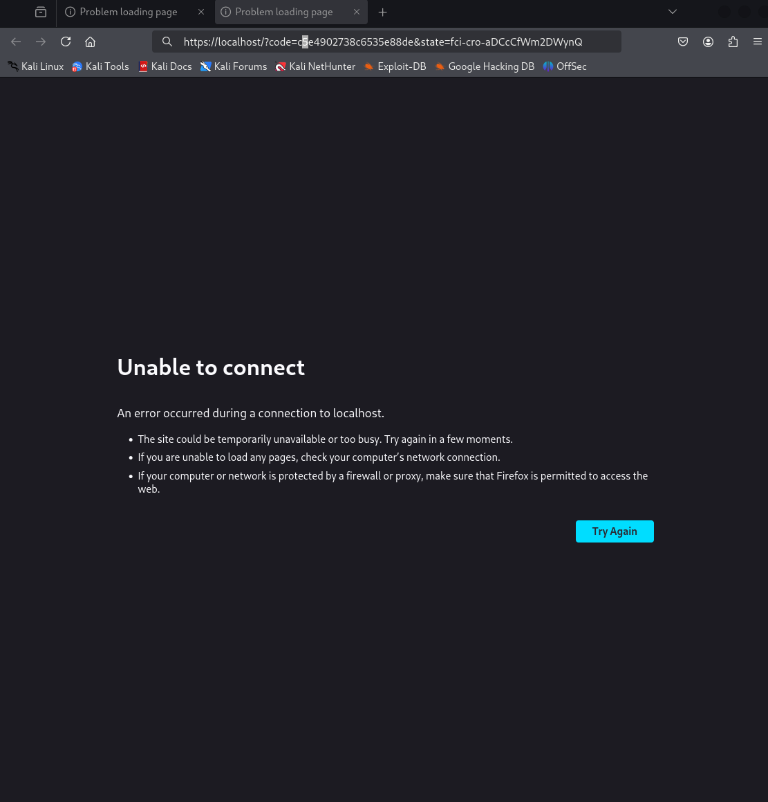

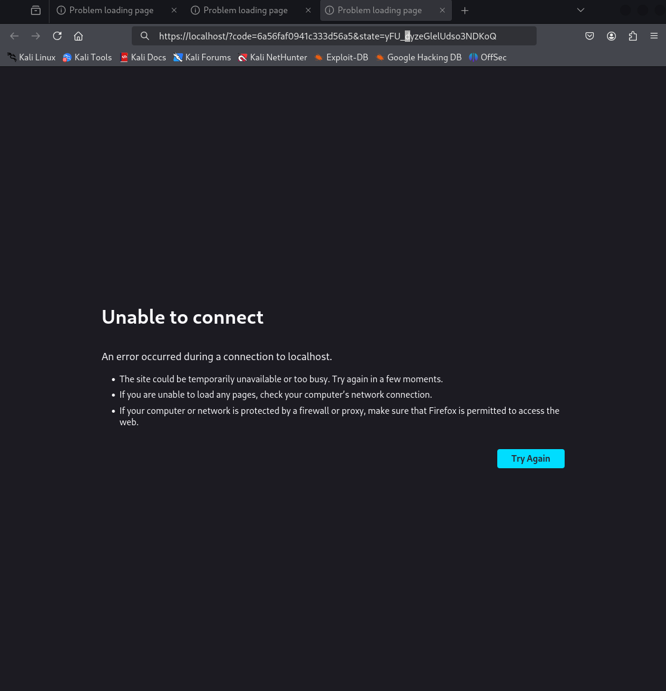

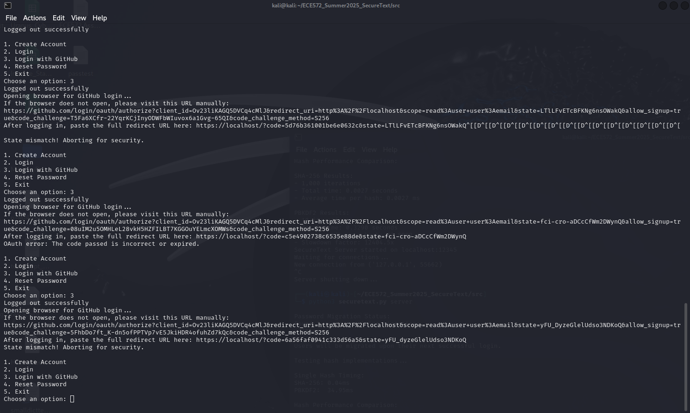

(The first two screenshots show tampering with code and state respecitvely, with the third showing the proper error messages and prompt to re-authenticate to the user)


---

### 2.3 Task 6: Zero Trust Implementation

#### 2.3.1 Objective
<!-- What was the goal of this task? -->
For task 6, the goal was to implement a series of authentication and control methods to practice the concept of "zero-trust" in our application. This meaning, assume every user in your network is compromised and authenticate / verify everywhere. This resulted in testing a new challenge-response authentication (simple), role-based access controls for user actions (standard user vs. and admin), and logging . basic activity monitoring in the event of any malicious activity.


#### 2.3.2 Implementation Details
<!-- Describe your implementation approach -->
```python
#Part A Code Implementation:
    #Added to our handle_client method:

                    elif command == 'CR_CHALLENGE':
                        username = message.get('username')
                        if username not in self.users:
                            response = {'status': 'error', 'message': 'Unknown user'}
                        else:
                            import secrets
                            challenge = secrets.token_hex(16)
                            cr_challenges[username] = challenge
                            response = {'status': 'ok', 'challenge': challenge}

                    elif command == 'CR_RESPONSE': #Server verifies response here before login
                            username = message.get('username')
                            client_mac = message.get('mac')
                            challenge = cr_challenges.get(username)
                            success = False
                            if not challenge:
                                response = {'status': 'error', 'message': 'No challenge issued'}
                            else:
                                # Use a shared secret for demo (insecure in real life!)
                                SHARED_KEY = "SecretKey123"
                                expected_mac = self.compute_mac(SHARED_KEY, challenge)
                                if hmac.compare_digest(client_mac, expected_mac):
                                    current_user = username
                                    self.active_connections[username] = conn
                                    response = {'status': 'success', 'message': 'Challenge-response login successful'}
                                    success = True
                                    print(f"[DEBUG] CR login for {username}: MAC verified, login allowed.")
                                else:
                                    response = {'status': 'error', 'message': 'Invalid response'}
                                    success = False
                                    print(f"[DEBUG] CR login for {username}: MAC mismatch, login denied.")
                                del cr_challenges[username]
                            if not success:
                                self.failed_logins[username] += 1
                                if self.failed_logins[username] >= 3:
                                    print(f"WARNING: 3 failed login attempts for user {username}")
                                    self.log_event(
                                        event="ALERT_FAILED_LOGINS",
                                        username=username,
                                        outcome="WARNING",
                                        details="3 failed login attempts"
                                    )
                                else:
                                    self.failed_logins[username] = 0
                    
                        conn.send(json.dumps(response).encode('utf-8'))

    #Added to our SecureTextClient Class, a new method for the challenge-response login:
    def challenge_response_login(self):
        print("\n=== Challenge-Response Login ===")
        username = input("Enter username: ").strip()
        # Step 1: Request challenge
        command = {'command': 'CR_CHALLENGE', 'username': username}
        response = self.send_command(command)
        if response['status'] != 'ok':
            print(f"Error: {response['message']}")
            return
        challenge = response['challenge']
        # Step 2: Compute HMAC and send response
        SHARED_KEY = "SecretKey123"
        mac = self.compute_mac(SHARED_KEY, challenge)
        command = {'command': 'CR_RESPONSE', 'username': username, 'mac': mac}
        response = self.send_command(command)
        print(f"{response['message']}")
        if response['status'] == 'success':
            self.logged_in = True
            self.username = username
            self.running = True
            listen_thread = threading.Thread(target=self.listen_for_messages)
            listen_thread.daemon = True
            listen_thread.start()

    #Updated our run method in SecuretextClient for new authentication option:
     while True:
            if not self.logged_in:
                print("\n1. Create Account")
                print("2. Login")
                print("3. Login with GitHub")
                print("4. Challenge-Response Login")  # <-- Add this
                print("5. Reset Password")
                print("6. Exit")
                choice = input("Choose an option: ").strip()
                
                if choice == '1':
                    self.create_account()
                elif choice == '2':
                    self.login()
                elif choice == '3':
                    self.github_login()
                elif choice == '4':
                    self.challenge_response_login()
                elif choice == '5':
                    self.reset_password()
                elif choice == '6':
                    break
                else:
                    print("Invalid choice!")

    # Showing the current time step (challenge) for TOTP in this print log within our login method for TOTP:
    current_time_step = int(time.time() / 30)
    print(f"TOTP challenge (time step): {current_time_step}")


#Part B Code Implementation for Role-Based Access Controls and Session Security:
    #Added to server side create_account method:
    self.users[username] = {
            'password_hash': password_hash,
            'totp_secret': encrypted_secret, # Store TOTP encrypted secret
            'created_at': datetime.now().isoformat(),
            'reset_question': 'What is your favorite color?',
            'reset_answer': 'blue',
            'role': 'user' #Default role
        }

    #Added to our handle_client method login call to get role in reponse:
        if success:
                current_user = username
                self.active_connections[username] = conn
                user_role = self.users[username].get('role', 'user')
        else:
                user_role = None
        response = {
                'status': 'success' if success else 'error',
                'message': msg,
                'role': user_role
                    }
    
    #For each out SecureTextClient logins, added the following call to store role information:
    self.role = response.get('role', 'user')

    #Then, added an is_admin method in our SecureTextClient to handle is_admin calls:
    def is_admin(self):
        return getattr(self, 'role', 'user') == 'admin'
    
    #Modified previous GRANT_ADMIN command in server side handle_client method to the following to grant users access (manually setting one user in user.json as default admin):
    elif command == 'GRANT_ADMIN':
            target_user = cmd_dict.get('username')
            password = cmd_dict.get('password')
            totp_code = cmd_dict.get('totp_code')
            if not current_user or self.users[current_user].get('role') != 'admin':
                response = {'status': 'error', 'message': 'Admin only'}
            elif target_user not in self.users:
                response = {'status': 'error', 'message': 'User not found'}
            else:
                # Re-authenticate admin
                success, msg = self.authenticate(current_user, password, totp_code)
                if not success:
                    response = {'status': 'error', 'message': 'Re-authentication failed'}
                else:
                    self.users[target_user]['role'] = 'admin'
                    self.save_users()
                    response = {'status': 'success', 'message': f"{target_user} is now an admin."}
    
    #Inserted grant_admin method to our client side class to run this command and prompt for password/TOTP when executed:
    def grant_admin(self):
        print("\n=== Grant Admin Role ===")
        username = input("Enter username to promote to admin: ").strip()
        password = input("Re-enter your admin password: ").strip()
        totp_code = input("Enter your TOTP code: ").strip()
        command = {
            'command': 'GRANT_ADMIN',
            'username': username,
            'password': password,
            'totp_code': totp_code
        }
        response = self.send_command(command)
        print(f"{response['message']}")

    #Added the following to our option menu to ensure user can only run this command if they are an admin along with an option for changing password as logged in user:
        else:
                print(f"\nLogged in as: {self.username}")
                print("1. Send Message")
                print("2. List Users")
                print("3. Send Command Message")
                print("4. Logout")
                print("5. Change Password")
                if self.logged_in and self.is_admin():
                    print("6. Grant Admin Role")
                choice = input("Choose an option (or just press Enter to wait for messages): ").strip()
                
                if choice == '1':
                    self.send_message()
                elif choice == '2':
                    self.list_users()
                elif choice == '3':
                    self.send_command_message()
                elif choice == '4':
                    self.logout()
                elif choice == '5':
                    self.change_password()
                elif choice == '6' and self.is_admin():
                    self.grant_admin()
                elif choice == '':
                    # Just wait for messages
                    print("Waiting for messages... (press Enter to show menu)")
                    input()
                else:
                    print("Invalid choice!")


    #Added commands handling in our handle_client method for LIST_USERS (admin only):
    elif command == 'LIST_USERS':
                        if not current_user:
                            response = {'status': 'error', 'message': 'Not logged in'}
                        elif self.users[current_user].get('role') != 'admin':
                            response = {'status': 'error', 'message': 'Admin only'}
                        else:
                            online_users = list(self.active_connections.keys())
                            all_users = list(self.users.keys())
                            response = {
                                'status': 'success', 
                                'online_users': online_users,
                                'all_users': all_users
                            }
    #Added commands handling in our handle_client method for RESET_PASSWORD (admin only) and password re-entry or TOTP for sensitive actions (in this case password reset):
    elif command == 'RESET_PASSWORD':
    # Support both logged-in and not-logged-in admin
    if current_user and self.users.get(current_user, {}).get('role') == 'admin':
        # Optionally require re-authentication here for extra security
        username = message.get('username')
        new_password = message.get('new_password')
        success, msg = self.reset_password(username, new_password)
        response = {'status': 'success' if success else 'error', 'message': msg}
    else:
        # Not logged in: require admin credentials in the message
        admin_username = message.get('admin_username')
        admin_password = message.get('admin_password')
        admin_totp = message.get('admin_totp')
        username = message.get('username')
        new_password = message.get('new_password')
        # Authenticate admin
        if not admin_username or self.users.get(admin_username, {}).get('role') != 'admin':
            response = {'status': 'error', 'message': 'Admin only'}
        else:
            success, msg = self.authenticate(admin_username, admin_password, admin_totp)
            if not success:
                # --- Logging for failed admin authentication ---
                self.failed_logins[admin_username] += 1
                if self.failed_logins[admin_username] >= 3:
                    print(f"WARNING: 3 failed admin login attempts for user {admin_username}")
                    self.log_event(
                        event="ALERT_FAILED_LOGINS",
                        username=admin_username,
                        outcome="WARNING",
                        details="3 failed admin login attempts for password reset"
                    )
                response = {'status': 'error', 'message': 'Admin authentication failed'}
            else:
                self.failed_logins[admin_username] = 0  # Reset on success
                success, msg = self.reset_password(username, new_password)
                response = {'status': 'success' if success else 'error', 'message': msg}
    conn.send(json.dumps(response).encode('utf-8'))
    continue  

    #Added Server side command for users changing passwords along with menu selection method and command call on client terminal:
    elif command == 'CHANGE_PASSWORD':
        if not current_user:
            response = {'status': 'error', 'message': 'Not logged in'}
        else:
            old_password = message.get('old_password')
            new_password = message.get('new_password')
            totp_code = message.get('totp_code')
            # Authenticate with either password or TOTP
            user = self.users[current_user]
            password_ok = False
            totp_ok = False
            if old_password:
                password_ok, _ = self.authenticate(current_user, old_password, None)
            if totp_code:
                totp_secret = self.decrypt_totp_secret(user['totp_secret'])
                totp = pyotp.TOTP(totp_secret)
                totp_ok = totp.verify(totp_code, valid_window=1)
            if not (password_ok or totp_ok):
                response = {'status': 'error', 'message': 'Authentication failed: must provide correct password or TOTP'}
            else:
                success, msg = self.reset_password(current_user, new_password)
                response = {'status': 'success' if success else 'error', 'message': msg}
        conn.send(json.dumps(response).encode('utf-8'))
        continue  
    def change_password(self):
        print("\n=== Change Your Password ===")
        old_password = input("Enter your current password (or leave blank to use TOTP): ").strip()
        new_password = input("Enter your new password: ").strip()
        totp_code = ""
        if not old_password:
            totp_code = input("Enter your TOTP code: ").strip()
        command = {
            'command': 'CHANGE_PASSWORD',
            'old_password': old_password,
            'new_password': new_password,
            'totp_code': totp_code
        }
        response = self.send_command(command)
        print(f"{response['message']}")    

    #Added to the handle_client method to deal with session management/ session timeout after 5 minutes or over 10 commands made:
    def handle_client(self, conn, addr):
    print(f"New connection from {addr}")
    current_user = None
    cr_challenges = {}
    conn.settimeout(1.0)  # Wake up every second to check for inactivity
    last_activity = time.time()
    action_count = 0
    TIMEOUT = 10  # 10 seconds for demo
    MAX_ACTIONS = 10

    try:
        while True:
            # Check for session timeout or max actions
            if time.time() - last_activity > TIMEOUT or action_count >= MAX_ACTIONS:
                response = {'status': 'error', 'message': 'Session timed out, please log in again.'}
                try:
                    conn.send(json.dumps(response).encode('utf-8'))
                except Exception:
                    pass
                break

            try:
                data = conn.recv(1024).decode('latin1')
                if not data:
                    break
                last_activity = time.time()  # Only update if data is received
                action_count += 1

                try:
                    message = json.loads(data)
                    command = message.get('command')
                    # rest of my other command handling goes in between here
                except json.JSONDecodeError:
                    error_response = {'status': 'error', 'message': 'Invalid JSON'}
                    conn.send(json.dumps(error_response).encode('utf-8'))
            except socket.timeout:
                # No data received, just loop and check timeout again
                continue
    except ConnectionResetError:
        pass
    finally:
        if current_user and current_user in self.active_connections:
            del self.active_connections[current_user]
        conn.close()
        print(f"Connection from {addr} closed")     
    
    #Added to the listen_for_messages method to deal with session logout on client side:
    def listen_for_messages(self):
        """Listen for incoming messages in a separate thread"""
        while self.running:
            try:
                data = self.socket.recv(1024).decode('utf-8')
                if data:
                    message = json.loads(data)
                    # Check for session timeout
                    if message.get('status') == 'error' and "timed out" in message.get('message', '').lower():
                        print("\n[!] Session timed out. Logging out.")
                        self.logout()
                        break
                    if message.get('type') == 'MESSAGE':
                        print(f"\n[{message['timestamp']}] {message['from']}: {message['content']}")
                        print(">> ", end="", flush=True)
            except:
                break

    #Added to run(self) method:
    if self.logged_in and not self.running:
                print("\n[!] Session ended (timed out or disconnected). Returning to login menu.")
                self.logged_in = False
                self.username = None
                self.role = 'user'
                self.oauth_logged_in = False
                self.access_token = None

    #Editing our client side reset_password prompt for password/ TOTP before we send the reset command:
    def reset_password(self):
        print("\n=== Reset Password ===")
        username = input("Enter username to reset: ").strip()
        new_password = input("Enter new password: ").strip()
        if self.logged_in and self.is_admin():
            # Use current session
            command = {
                'command': 'RESET_PASSWORD',
                'username': username,
                'new_password': new_password
            }
        else:
            # Prompt for admin credentials
            admin_username = input("Enter your admin username: ").strip()
            admin_password = input("Enter your admin password: ").strip()
            admin_totp = input("Enter your TOTP code: ").strip()
            command = {
                'command': 'RESET_PASSWORD',
                'username': username,
                'new_password': new_password,
                'admin_username': admin_username,
                'admin_password': admin_password,
                'admin_totp': admin_totp
            }
        response = self.send_command(command)
        print(f"{response['message']}")    

#Part C Code Implementation for Logging and Basic Monitoring:

    #At the top of our file, added the logging library and a basic configuration with a method call:
    import logging

    logging.basicConfig(
        filename='securetext_server.log',
        level=logging.INFO,
        format='%(asctime)s %(levelname)s %(message)s'
    )

    def log_event(self, event, username=None, outcome=None, details=None):
        msg = f"EVENT={event}"
        if username:
            msg += f" USER={username}"
        if outcome:
            msg += f" OUTCOME={outcome}"
        if details:
            msg += f" DETAILS={details}"
        logging.info(msg)

    #Added various logging for authorization event and commands executed such as in LOGIN, RESET PASSWORD, GRANT ADMIN, LIST_USERS, COMMAND_MSG etc.:
        #For authorization:
        self.log_event(
            event="AUTH_ATTEMPT",
            username=username,
            outcome="SUCCESS" if success else "FAIL",
            details=msg
        )
        #For Commands:
        self.log_event(
            event=f"COMMAND_{command}",
            username=current_user,
            outcome=response.get('status'),
            details=str(message)
        )
        #For OAuth:
        self.log_event(
            event="OAUTH_LOGIN",
            username=matched_user,
            outcome="SUCCESS",
            details=f"GitHub login for {github_username} ({github_email})"
        )
        self.log_event(
                event="OAUTH_LOGIN",
                username=new_username,
                outcome="WARNING",
                details=f"GitHub username taken, assigned {new_username} for {github_email}"
            )
        self.log_event(
                event="OAUTH_LOGIN",
                username=new_username,
                outcome="SUCCESS",
                details=f"New GitHub account {github_username} ({github_email})"
            )
    
    #Added the following to our server initialization for failed logins:
    self.failed_logins = collections.defaultdict(int)

    #I then added the following block to print a warning after 3 failed login attempts in a row in various login method calls:
    if not success:
        self.failed_logins[username] += 1
        if self.failed_logins[username] >= 3:
                print(f"WARNING: 3 failed login attempts for user {username}")
                self.log_event(
                        event="ALERT_FAILED_LOGINS",
                        username=username,
                        outcome="WARNING",
                        details="3 failed login attempts"
                )
    else:
        self.failed_logins[username] = 0  # Reset on success
    
    #E.g. also added to Challenge-response login:
                                success = False
                            del cr_challenges[username]
                        if not success:
                            self.failed_logins[username] += 1
                            if self.failed_logins[username] >= 3:
                                print(f"WARNING: 3 failed login attempts for user {username}")
                                self.log_event(
                                    event="ALERT_FAILED_LOGINS",
                                    username=username,
                                    outcome="WARNING",
                                    details="3 failed login attempts"
                                )
                            else:
                                self.failed_logins[username] = 0

```

#### 2.3.3 Challenges and Solutions
<!-- What problems did you encounter and how did you solve them? -->
The biggest problems I faced with these implementations was 1. properly implementing session timeouts and 2. properly configuring password resets for both logged in users (requiring them to re-authenticate) and admins looking to change another user's password from the base console menu before being logged in. For session timeout, I struggled with this because I had to properly loop a socket connection timeout to accurately note a users inactivity. The main error was simply syntax in my loop structure that unfortunately took me significantly longer to fix than I am happy to admit. For proper password resets, the problems came in the fact I had to make two different commands and method calls, one for admins that they would access before even logging by selecting the reset password command, authenticating by login to an admin account, and then being allowed to change another user's password. For users, they had to be logged in, see a new command option listed, and then re-authenticate when selecting which simply required a lot of method adjustments in my code to fix overall resulting in a avery time consuming task.

#### 2.3.4 Testing and Validation
<!-- How did you test that your implementation works correctly? -->
In the following screenshots you will see an iterative test to each aspect of our required implementation via code below:

For part A: the following screenshots show a succesful implementation of the simple challenge-response mechanism, a display of how TOTP is a time-based version using c = current_time / 30 printed to the console, defined user roles, only allowing certain commands to be executed by certain roles, session timeouts and password re-entry for sensitive commands, and finally, logging for commands executed and monitoring for suspicious activity.

1. In this screenshot, we see a succesful challenge-response authentication login with the verified response printed to our server console:

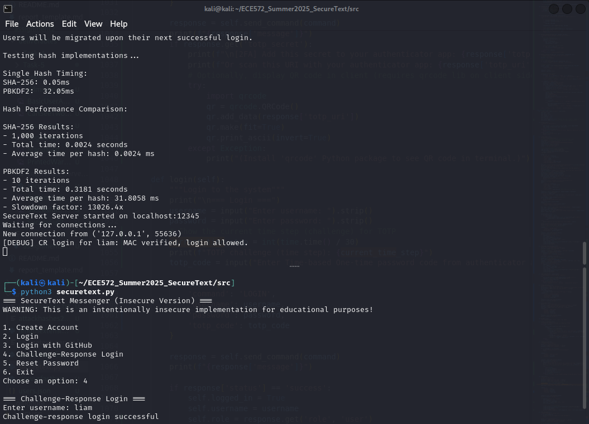

2. In this screenshot we see the TOTP time comparison where current_time / 30 = c is printed to our console:

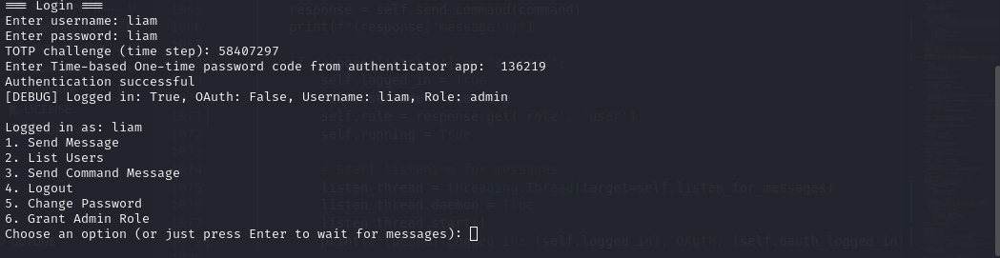

3. In these screenshots we see our defined roles of user or admin, with a manually assigned admin role to user "liam" after clearing the pre-existing users for cleaner demos:

.png)

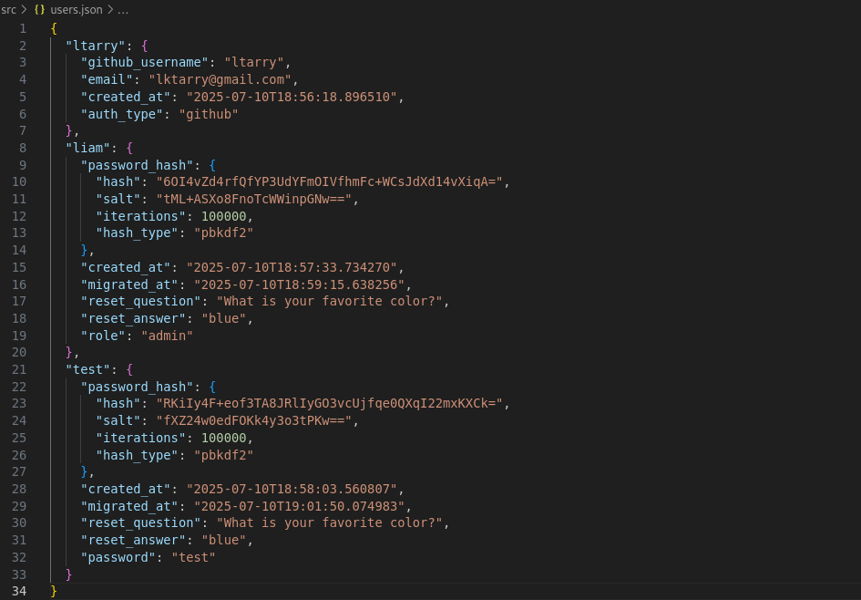

4. In this screenshot on the right-hand console a console printed alert denying a non-admin user from executing the command to list users:

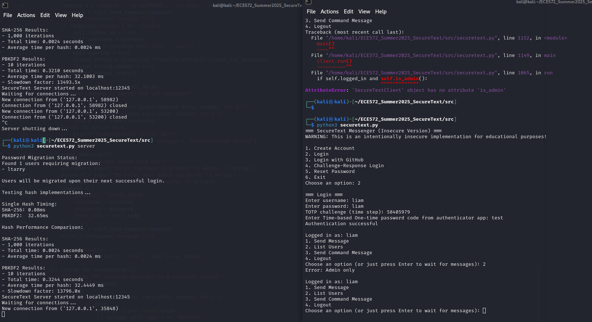

5. In this screenshot we see our designated admin user succesfully execute the command to list active users of the application and change the test user's password in the right hand console:

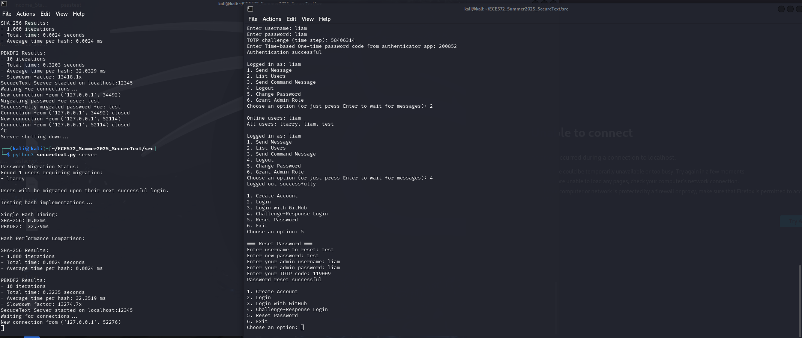

6. In these screenshots we see how both session timeouts after 5 minutes (demod with 10 seconds for convenience but current code holds 5 minutes) and excess of 10 commands (demod with 2) will log a user out requiring re-authentication:

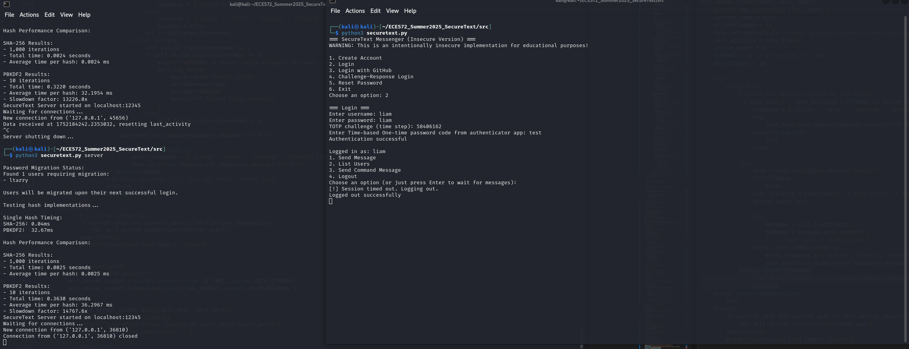

.png)

7. In this screenshot we see a standard user succesfuly re-set their password after being prompted to re-authenticate even when logged in, as it is deemed a sensitive action (right hand console):

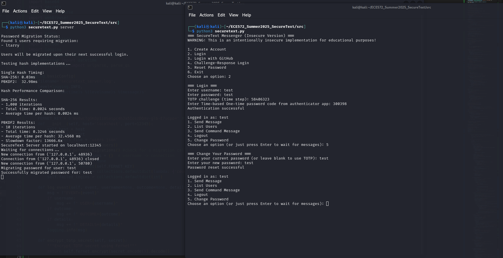

8. In this screenshot we see our logging output to our log file showing authentication attempts (success and failed), users commands with timestamps and outcomes, and any role-based access attempts:

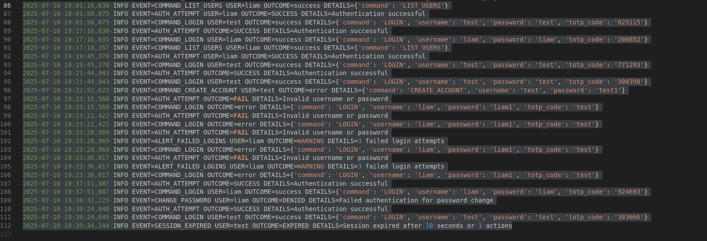

9. Finally, in this screenshot we see a printed warning to the server console after a user has 3 failed authentication attempts in a row (left hand console):

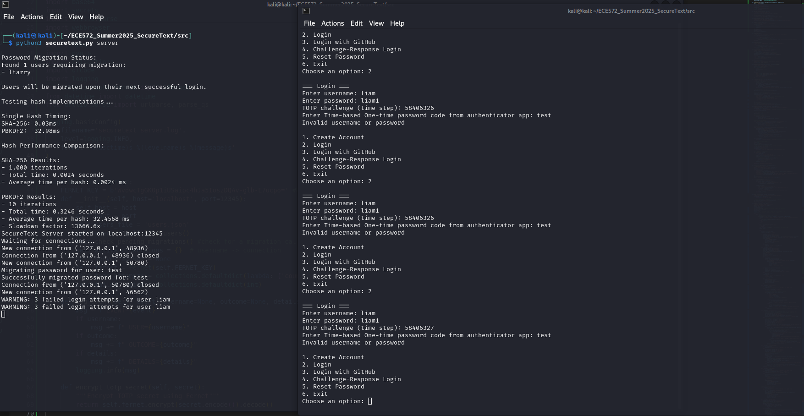


#### 2.3.4 Security Analysis/ Report and Attack Demonstration
**Part A. TOTP as Challenge response - Comparing TOTP vs Basic challenge-response:**
In terms advantages to both TOTP vs basic challenge-response authentication, they each have their pros and cons. With TOTP, it is likely more secure as by default it mitigates replayability attacks in its time based aspect. By only allowing a time window such as 30 seconds, this makes it signficantly harder for an attacker to succefuly conduct an attack. Not only that but in TOTP the challenge is the time aspect, meaning no challenge needs to be communicated between server and client. The drawbacks with this is that it required clock sync between devices to function properly, otherwise this can prevent users from login based on the time property. 

Comparing that to a simple challenge-response authentication, replay attacks are possible in this process (<https://hideez.com/en-ca/blogs/news/what-is-a-replay-attack#:~:text=The%20Challenge%2DHandshake%20Authentication%20Protocol,a%20new%20challenge%2Dresponse%20exchange.>). While we use a demonstrated shared secret key between the client and server and assume its secure in our example, a replay attack is still possible through methods such as re-using the same challenge and response if the server does not keep track, granting them access on login. In my code I help mitigate this by deleting the challenge after use with "del cr_challenges[username]." However, in theory an attacker could intercept and send the reponse before the user if they are fast enough with my code currently to conduct a replay attack. Another weakness is simply the need to communicate a challenge and response between client and server. While modern encryption can help reduce risks in these common communication streams, it is still likely that the entire exchange can be recorded and doicumented by a malicious actor. While these are major drawbacks with the simple challenge-response based authentication, the benefits are in that it is simple and can be developed to reduce threats. A simple-challenge based method does not require clock synchonization nor necessarily require action by the user allowing for a simpler and more convenient experience.

**Part C. Security Report Discussion Results**
The zero trust design choices I implemented where to display proper levels of security for the previously specified actions in my code snippets, without making it overly complex in design and demo display. This means for example, I implemented role-based command restrictions, session expiration, command limits, logging for activity monitoring and re-authentication for sensitive operations but exempted going into more complex designs beyond a simple implementation. To further explain this lets look atr how my system verifies identity continously.

If a user logs in, they have to do via TOTP, Github, or our challenge-response based authentication methods. It is extremely important to note that since this is our demo environment with a simple challenge-response authentication, it is assumed a standard shared key exists between the server and user which is why it is technically insecure in its current standing by simply inserting a username in the client terminal. However, in a real-world scenario, this would be a seperate device that holds the shared key to allow for that ease of use and safe-login. After a user logs in, they can freely send messages and use the application as it is intended, but, their is a limit to throttle command usage by users along with a re-authentication process if they wish to change passwords. This helps us by assuming any user account is compromised and requires re-authentication (either by password or TOTP) when changing their password, or throttling the level of potentially harmful action that can be taken (such as excessive command calling potentially leading to a DoS or other malicious actions). Following a basic user functionality, there is the ability to offer management based commands such as listing users registered in the application or changing antoher user's password (in the event an account is compromised or credentials are forgotten even with 2FA recovery). however, this requires role based access as an admin who are exclusively the only users that can initiate these commands. Even from our initial terminal, if the "reset password" command is selected, we require an admin user login and verification by one of our authentication methods. This does provide limitations however, as mentioned prior I have a weak challenge-response authentication due to an assumed secret-key, I also require curreently only a password OR TOTP to reset a user's password when in reality it should require both for 2FA. Lastly, for authentication design, we have only a warning implemented to the server for 3 failed authentication methods to an account, when in reality there should be an account lockout or feature to slow down an attacker from continously guesdsing passwords to users on the application. While there are likely others, these are the main highlighted limitations to my current design choices but at its current moment there are continous logging and verfication steps to monitor and validate user actions, especially any that may be sensitive.

Comparing password login, TOTP and challenge-response authentication together, I would personally be inclined to use TOTP due to it being the most secure for a fairly easy implementation. While challenge-response can be very easdy to use from a user perspective, it's security flaws compared to that of TOTP (such as the previously mentioned replay compromises or other weaknesses) make it less desirable to myself when designing this application, but may be better suited for others. It is important to note the authentication method used is dependendant on factors like risk-appetite, severity of information held or contained in an application, user experience and other important factors to an orghanization when designing authentication methods for any applications. By far the worst is a simple password use for login credentials. While in theory it can be fairly secure with complex, at least psuedo-random, passwords, users do not typically make strong password and it is often safe to assume passwords can be easily compromised, lost or forgotten on a users end. This makes me lean towards the other implemented means of authentication at the minimum when implementing them to this application.

---

## 3. Security Analysis

### 3.1 Security Improvements
<!-- Document the security enhancements you implemented -->

**Before vs. After Analysis**:
- **Authentication**: [If applicable otherwise remove][Improved through the introduced various ways a user can now authenticate themselves on account creation or login, along with requiring users to authenticate when attempting sensisitve actions.]
- **Authorization**: [If applicable otherwise remove][Authorization improved by introducing role-based access to certain commands, ensuring unauthorized users cannot complete senitive commands.]  
- **Data Protection**: [If applicable otherwise remove][Data protection improved in two main ways. The first being the means of user authentication: whether it be making it more difficult to access a users account via TOTP, limiting data exchanged in our simple challenge-response, or  OAuth with PKCE only storing data credentials in memory. The second being our monitoring and logging of suspicious user activity, by monitoring for sensitive actions like failed logins and password resets, we add an extra level of security to user data.]
- **Communication Security**: [If applicable otherwise remove][Communication security was improved only through the means of externally authenticating a user with the server, reducing the amount of sensitive information communicated between users and the server through the new authentication methods.]

### 3.2 Threat Model
<!-- Describe the threats your implementation addresses -->
The major threats my implementation reduces is primarily through the malicious server operator and compromised client. These are both mitigated by enforcing stricter authentication means for user accounts, reducing insider threats from moving laterally from one user to another. The role based access and logging  / monitoring also help reduce these two threat actors as they help catch these actors early through the rule enforcment and notification to potentially sensitive and compromising actions, limiting their movement and ability to cause harm.


**Use the following security properties and threat actors in your threat modeling. You can add extra if needed.**

**Threat Actors**:
1. **Passive Network Attacker**: Can intercept but not modify traffic
2. **Active Network Attacker**: Can intercept and modify traffic
3. **Malicious Server Operator**: Has access to server and database
4. **Compromised Client**: Attacker has access to user's device

**Security Properties Achieved**:
- [ ] Confidentiality
- [ ] Integrity  
- [Y] Authentication
- [Y] Authorization
- [Y] Non-repudiation
- [ ] Perfect Forward Secrecy
- [ ] Privacy

---

## 4. Attack Demonstrations

See respective security analysis and testing/ validation sections for tasks 4, and 5 for our required attack demonstartions. Those being: compromised passwords with TOTP protection and session handling for expired or missing tokens.


---

## 5. Lessons Learned

### 5.1 Technical Insights
<!-- What did you learn about security implementations? -->

1. **Insight 1**: [The major cost and benefit analysis for authentication methods needed to be conducted for any application when being developed. There are pros and cons to each that are each respective the cosst associated, means to design, and risk appetite to an organization]
2. **Insight 2**: [How much of a difference proper logging and monitoring can make it reducing malicious action and integrity of users accounts. By flagging suspicious activity not only in general but accurately and swiftly, can help in early recognition to insider threats.]


### 5.2 Security Principles
<!-- How do your implementations relate to fundamental security principles? -->

**Applied Principles**:
- **Defense in Depth**: [Combination of authentication, authorization, infromation collection, and least privilege applications to users actions in our app]
- **Least Privilege**: [Role-based Access]
- **Fail Secure**: [Re-authentication for sensitive actions (compromised accounts)]
- **Economy of Mechanism**: [Keeping authentication as simple as possible for the user while remaining secure]

---

## 6. Conclusion

### 6.1 Summary of Achievements
<!-- Summarize what you accomplished -->
In summary, throughout this assignment I have explored the process of implementing various authentication means for users, reducing lateral movement inside an application or network through role-based access, re-authentication, monitoring and logging, and understanding the relevant attack vectors that still exist in my current implementation. Although still not secure completely, the methods introduced in this assignment help make large strides in the direction to making a secure and usable application publicly.

### 6.2 Security and Privacy Posture Assessment
<!-- How secure is your final implementation? -->
My final implementation is still not very secure as it's comunication streams are still open to passive attackers being able to read messages and there is minimal input validation for threats like cross-site scripting (I only introduced validation for authentication methods such as in 0Auth). Additionally, even though I introduced monitoring for failed authentication attempts, there is no delay or lockout protcol in place in the event an attacker tries to repeatedly try to guess a password for a brute-froce attack.

**Remaining Vulnerabilities**:
- Vulnerability 1: [Communication streams are still readable to passive attackers (messages, TOTP codes and tokens etc.)]
- Vulnerability 2: [Minimal input validation as we only review authorization methods and not user inputs]

**Suggest an Attack**: One attack that could be conducted currently is simply a brute force attack with a users username taken from sniffing any communication made.

### 6.3 Future Improvements
<!-- What would you do if you had more time? -->

1. **Improvement 1**: [Add a time delay / account lockout to any failed login authentication attempts over 3.]
2. **Improvement 2**: [Add per session shared keys instead of the fixed demo key for challenge-response authentication.]

---

## 7. References

<!-- 
Include all sources you referenced, including:
- Course materials and lecture notes
- RFCs and standards
- Academic papers
- Documentation and libraries used
- Tools and software references
-->
1. ChatGPT - https://chatgpt.com/
2. Claude/Copilot - https://github.com/features/copilot
3. <https://www.entrust.com/blog/2014/10/understanding-sha-1-vulnerabilities-is-ssl-no-longer-secure#:~:text=What%20are%20the%20issues%20with,2018%20and%20$43%2C000%20in%202021.>
4. <https://supertokens.com/blog/otp-vs-totp-vs-hotp>
5. <https://frontegg.com/blog/what-is-a-time-based-one-time-password-totp#:~:text=A%20minor%20time%20skew%20might,reliability%20and%20usability%20of%20TOTP.>
6. <https://www.loginradius.com/blog/engineering/advantages-of-totp>
7. <https://www.ownyouronline.govt.nz/personal/know-the-risks/common-risks-and-threats/sim-swapping-attacks/#:~:text=A%20SIM%20swap%20attack%20is,access%20to%20your%20personal%20information.>
8. <https://en.wikipedia.org/wiki/SIM_swap_scam>
9. <https://stytch.com/blog/totp-vs-sms/>
10. <https://docs.github.com/en/apps/oauth-apps/building-oauth-apps/authorizing-oauth-apps>
11. <https://www.weareplanet.com/blog/what-is-auth0>
12. <https://www.techtarget.com/searchapparchitecture/definition/OAuth#:~:text=OAuth%2C%20which%20is%20pronounced%20%22oh,credentials%20to%20the%20third%20party.>
13. <https://www.omnidefend.com/pros-and-cons-of-using-auth0-for-two-factor-authentication/>
14. <https://www.authgear.com/post/pkce-in-oauth-2-0-how-to-protect-your-api-from-attacks#:~:text=Authorization%20Code%20Interception%3A%20In%20the,token%20without%20the%20client's%20knowledge.>
15. <https://community.auth0.com/t/invalid-state-error-when-using-authorize-endpoint-directly-in-conjunction-with-the-auth0-spa-sdk/105239>
16. <https://portswigger.net/web-security/oauth#:~:text=If%20the%20OAuth%20service%20fails,to%20an%20attacker%2Dcontrolled%20redirect_uri%20.>
17. <https://hideez.com/en-ca/blogs/news/what-is-a-replay-attack#:~:text=The%20Challenge%2DHandshake%20Authentication%20Protocola%20new%20challenge%2Dresponse%20exchange.>

---

## Submission Checklist

Before submitting, ensure you have:

- [ ] **Complete Report**: All sections filled out with sufficient detail
- [ ] **Evidence**: Screenshots, logs, and demonstrations included
- [ ] **Code**: Well-named(based on task and whether it is an attack or a fix) and well-commented and organized in your GitHub repository deliverable directory of the corresponding assignment
- [ ] **Tests**: Security and functionality tests implemented after fix
- [ ] **GitHub Link**: Repository link included in report and Brightspace submission
- [ ] **Academic Integrity**: All sources properly cited, work is your own

---

**Submission Instructions**:
1. Save this report as PDF: `[StudentID]_Assignment[X]_Report.pdf`
2. Submit PDF to Brightspace
3. Include your GitHub repository fork link in the Brightspace submission comments
4. Ensure your repository is private until after course completion otherwise you'll get zero grade

**Final Notes**:
- Use **GenAI** for help but do not let **GenAI** to do all the work and you should understand everything yourself
- If you used any **GenAI** help make sure you cite the contribution of **GenAI** properly
- Be honest about limitations and challenges
- Focus on demonstrating understanding, not just working code
- Quality over quantity - depth of analysis is more important than length
- Proofread for clarity and technical accuracy

Good luck!
